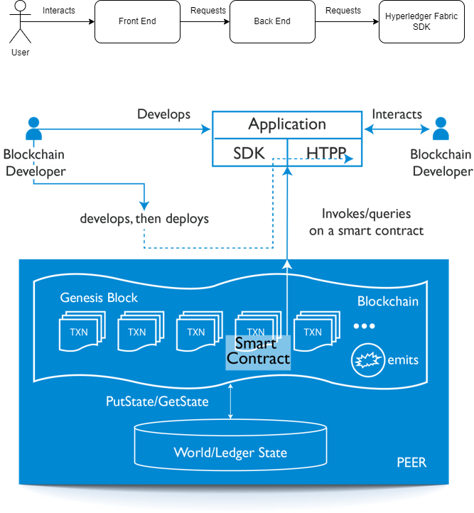

# Gift Card Management!
In this project, we will use Hyperledger Fabric to create a system for generating gift cards with balances and keeping track of all the data related to them in a ledger. The ledger will be distributed and immutable, ensuring the security and transparency of the gift card transactions.

### The project will have the following functionalities:

1. <ins>Show all cards</ins>: The system will allow retailers to view all the gift cards that have been created, along with their current balances and ownership information.

2. <ins>Create a card</ins>: Users will be able to create new gift cards with a specific balance. The system will generate a unique ID for each card, which will be stored on the ledger along with the card's balance and other relevant information.

3. <ins>Transfer ownership of a card</ins>: Users will be able to transfer ownership of a gift card to another user. The system will update the ownership information on the ledger, ensuring that all transactions are recorded and transparent.

4. <ins>Redeem total balance from a gift card</ins>: Gift card owners will be able to redeem the card's balance for goods or services. The system will update the ledger and delete the card from the system.

## CONTRIBUTORS

Surya Pranesh Krishnan - 101442686  
Shantanu Ail - 101413427  
Vishnu Sankar - 101440532  

## PROBLEM STATEMENT
Developing a secure and transparent platform using Hyperledger Fabric to prevent gift card scams and ensure that consumers can purchase and use gift cards with confidence. Gift card scams have become a common issue, with scammers using various techniques such as the manipulation of the bar code on the back of the card to defraud consumers of their money. Due to their practicality and simplicity, gift cards are a well-liked option over the holidays.  
 
However, they are also vulnerable to fraud. The scammers take the cards home, apply the stickers, and then rehang them in the stores. The funds ultimately end up on the card the scammers have at home that is linked to the sticker barcode after the victim pays for the card at the cash register.

## GOALS
The goal of this project is to develop a robust and reliable platform that prevents gift card scams and ensures the integrity of gift card transactions. The success of this project will be measured by its ability to reduce gift card fraud, increase consumer confidence in gift cards, and provide businesses with a secure and efficient platform for managing gift card transactions.  
 
Additionally, the barcodes should only be printed on the gift cards at the cash register once the payment has been made.
## STAKEHOLDERS

- Consumers: The primary stakeholders are consumers who purchase and use gift cards.
- Businesses: The businesses that issue gift cards are also stakeholders.
- Gift Card Recipients: The individuals who receive the gift cards from the issuers.
- Regulators: Government agencies or other entities that may be responsible for overseeing the gift card industry and ensuring compliance.
- Administrators: The individuals who will be responsible for managing the gift card system.

## Application Flow

### Supplier - Retailer Flow
- A supplier (Apple) will print a thousand gift cards and issue them to a retailer (Walmart) which will be updated in the ledger. The retailer upon receiving them shall update in the ledger that they have received it. The commiters in both the organisations shall approve these transactions submitted by the endorsers.

### Retailer - Consumer Flow
- When a consumer wishes to purchase a gift card of the previously mentioned supplier, they can pick the desired gift card of whichever amount they want and go to the cashier of the retailer to pay for it. The cashier then collects the payment for the gift card and prints a barcode on it. The cashier then proceeds to get the name of the owner and stores that in the ledger.
- The ownership of the card will be visible to both the retailer and the supplier to instill transparency and trust in the system. Also, the consumer has the option to transfer the ownership of the card at the retailers PoS.
- After purchasing the gift card, the consumer can redeem it at the suppliers store or website. Once this is done, the gift card gets deleted from the ledger and is invalid.

# ARCHITECTURE

  

### FUNCTIONS - INPUTS/OUTPUTS

#### GiftCard CONTRACT
- initLedger: This function is used to initialize the gift card management system's ledger.
- createGiftCard: This function is used to create a gift card with a randomized sixteen digit ID used for making the barcode.
- getGiftCard: This function is used to display the details of a particular gift card.
- getAllGiftCards: This function is used to display all the active gift cards issued by the retailer.
- transferGiftCard: This function is used to transfer the ownership of the gift card from one person to another. 
- redeemGiftCard: This function is used to redeem the amount of the gift card by the consumer.

## DIAGRAM (FLOW CHART)

## TECH STACK
- Programming languages: Javascript. 
- Blockchain platform: Hyperledger Fabric.

# HOW TO RUN PROJECT
Install hyperledger in root folder

Create Channel using test-network/network.sh

Install Chaincode on both organisations

Adding peer config

Initialize chaincode to check if everything runs

Running backend

Running front-end

